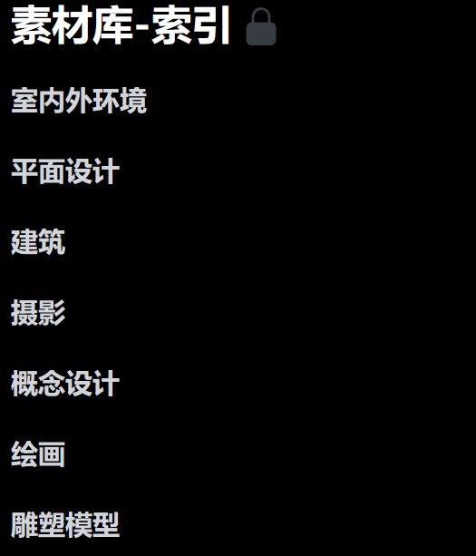
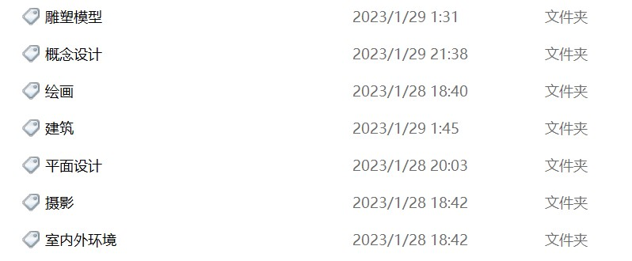
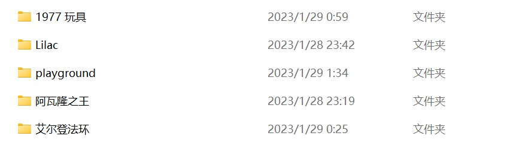
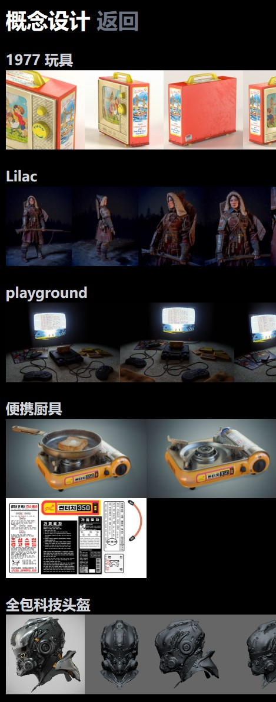
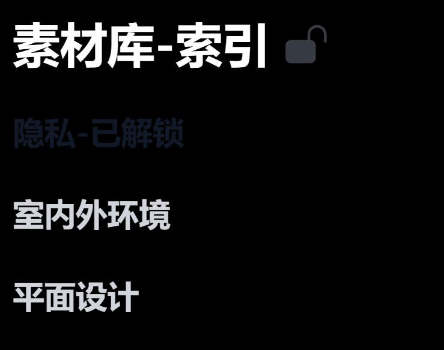
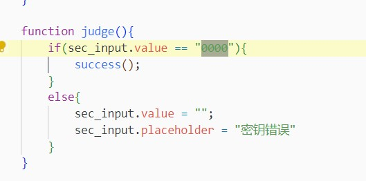

# Reference Image Presenter for Artistic Creation
基于 `NodeJS` 的本地的艺术创作参考图展示工具 

NodeJS-based local art creation reference map display tool

## 使用教程

在 `fileNameLoader.js` 同目录使用 `nodemon fileNameLoader.js` 命令启动 `8088` 端口，需要保证 `nodemon` 安装和 `8088` 端口闲置，之后打开 `index.html` 即可打开展示工具

Use the 'nodemon fileNameLoader.js' command to start the '8088' port in the same directory as 'fileNameLoader.js', you need to ensure that the 'nodemon' installation and '8088' port are idle, and then open 'index.html' to open the display tool

## 使用效果

<table align=center>
    <tr>
<td>

</td>
<td>

</td>
    </tr>
    <tr>
<td>

索引页面

</td>
<td>

点击索引内容后的内容页面（以建筑为例）

</td>
    </tr>
</table>

## 文件如何存储
`html` 中文件树结构与文件资源管理器文件树结构是同步的

<table align=center>
    <tr>
<td>

</td>
<td>

</td>
    </tr>
    <tr>
<td>

文件资源管理器中文件目录

</td>
<td>

显示目录

</td>
    </tr>
</table>

<table align=center>
    <tr>
<td>

</td>
<td>

</td>
    </tr>
    <tr>
</td>
<td>

文件资源管理器中文件目录

</td>
<td>

显示目录

</td>
    </tr>
</table>

## 隐藏文件
### 隐藏文件的使用

<table align=center>
    <tr>
<td>

</td>
<td>

</td>
<td>

</td>
    </tr>
    <tr>
<td>

点击 锁 图像

</td>
<td>

输入密钥

默认为 0000

</td>
<td>

点击 “隐藏-已解锁内容” 

跳转到隐藏文件夹

</td>
    </tr>
</table>

### 隐藏文件的位置 
`.\source_file\config\config_files\ext\ext\ext`

该文件目录与显示的目录相同

### 修改隐藏文件的密码

>**说明：** 修改 `0000` 为想要设置的密码\
注意这里的密码为弱加密，查阅源代码就会破解密码\
可以加入其他 `js` 交互要求才能进入隐藏文件夹\
或通过 `express` 向数据库中查询以检验密码进入隐藏文件夹

## 环境依赖
>    "axios": "^1.2.5",\
    "express": "^4.18.2",\
    "fs": "^0.0.1-security",\
    "nodemon": "^2.0.20",\
    "path": "^0.12.7"

